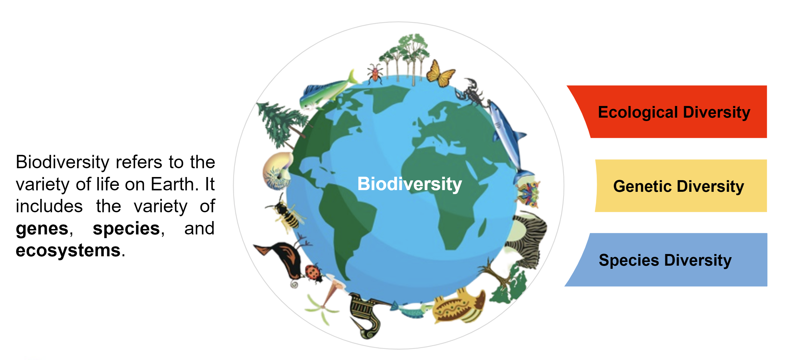
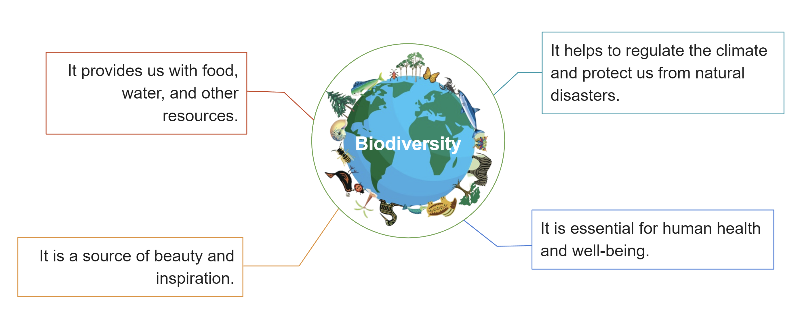
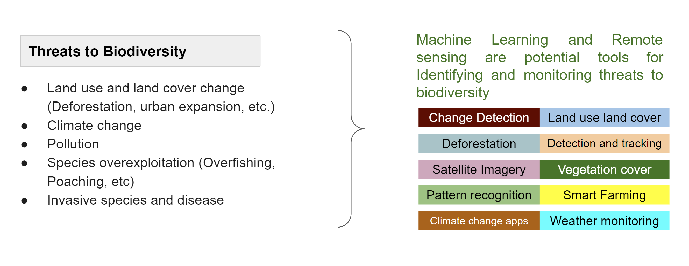
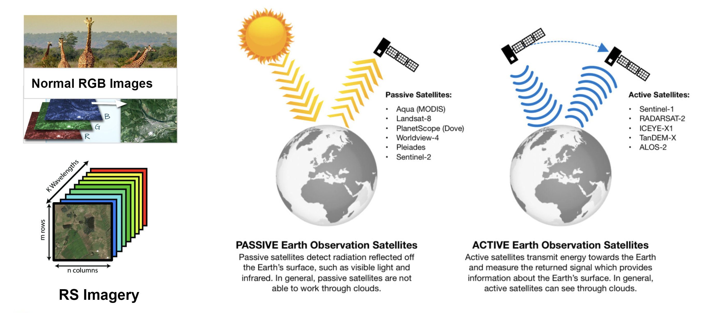
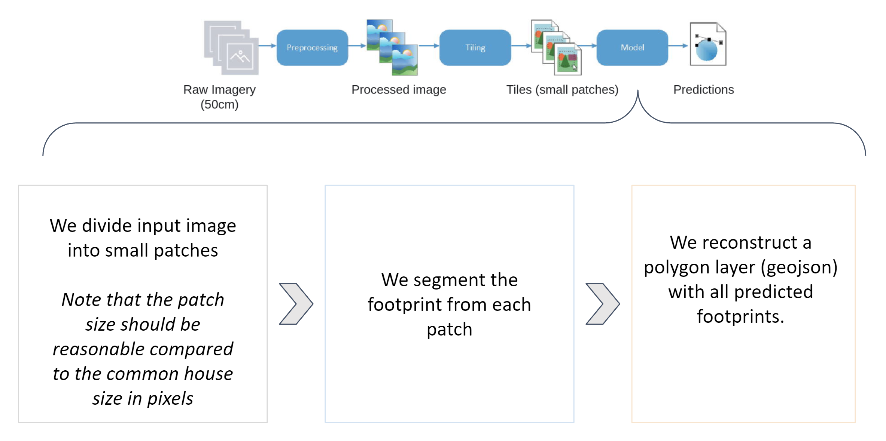
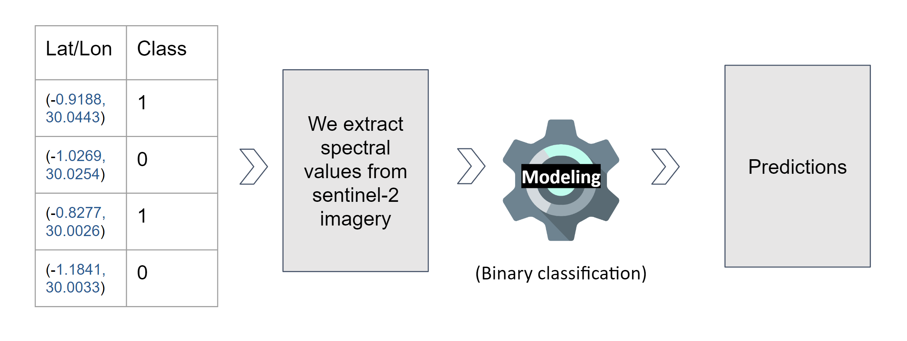
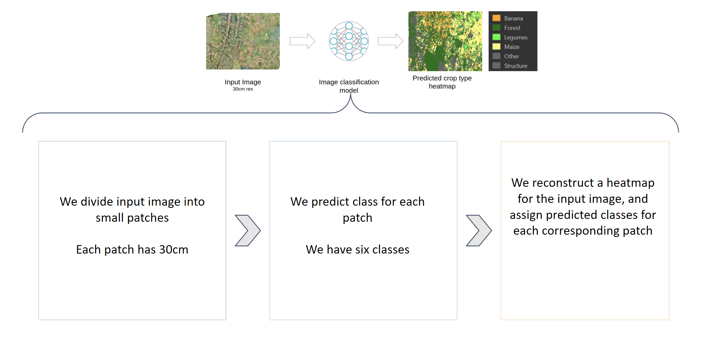
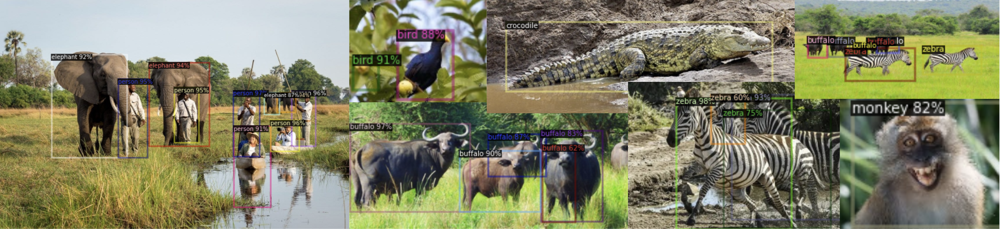

# ACE_DS_Seminar

Seminar theme **“Building Solutions to the Biodiversity protection using
Machine Learning Algorithm: An Invest Model perspective”**

## What is Biodiversity (Biological Diversity)?

## Importance of Biodiversity

## Biodiversity is under threat from a number of factors

## Data and Sensing

## Model Perspective: Detecting Building Footprints

## Model Perspective: Identifying cropland

## Model Perspective: Identifying crop-types

## Model Perspective: Animal Detections

## Labs

## Summary
