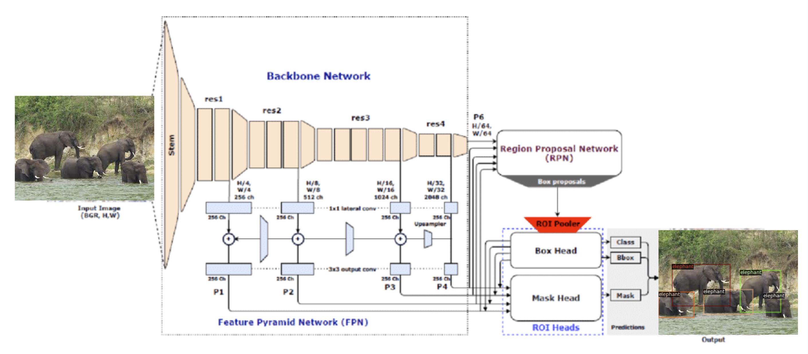
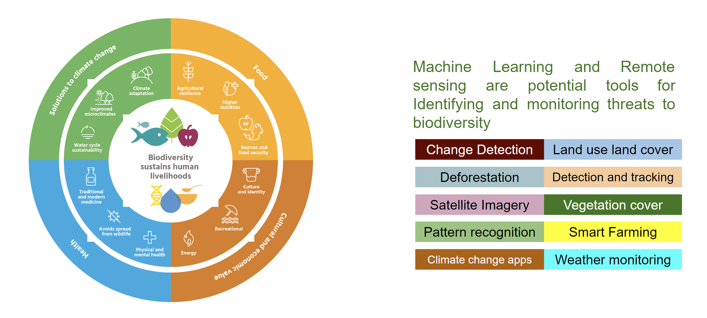

# ACE_DS_Seminar

Seminar theme **“Building Solutions to the Biodiversity protection using
Machine Learning Algorithm: An Invest Model perspective”**

## What is Biodiversity (Biological Diversity)?

## Importance of Biodiversity

## Biodiversity is under threat from a number of factors

## Data and Sensing

## Model Perspective: Detecting Building Footprints

## Model Perspective: Identifying cropland

## Model Perspective: Identifying crop-types

## Model Perspective: Animal Detections

## Labs
[Cropland Classification](https://drive.google.com/file/d/1xrRpRvlaBPcOoCe3w_eONWIgpdCvU01J/view?usp=sharing) | [Animal Detection](https://drive.google.com/file/d/1_SUPApPj5qLbxGLg8bnYO3571qXFqK_p/view?usp=sharing) | [Visualizing Sentinel Imagery](https://drive.google.com/file/d/1bAWVWHsLIELtD55BIC5gszZCWwBM2OT9/view?usp=sharing)
## Summary
